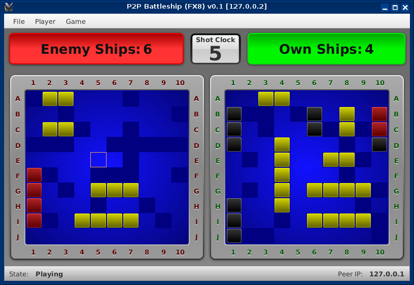

# Battleship (FX8) 
Simple P2P [Battleship Game](http://en.wikipedia.org/wiki/Battleship_%28game%29) using **JavaFX 8**

## Some Notes

* This is free and open software developed for **research and educational** purposes only
* Main purpose: Fiddle around with Java(FX) 8 features
* Using UDP on the Transport Layer
* Message <-> Object DeSerialization using Gson
* Separation of GUI (FXML/CSS) and program logic

## Dependencies

* JavaFX **8u40 or later**
* [Google Gson](https://code.google.com/p/google-gson)
* [Tinylog](http://www.tinylog.org)

## Screenshot

