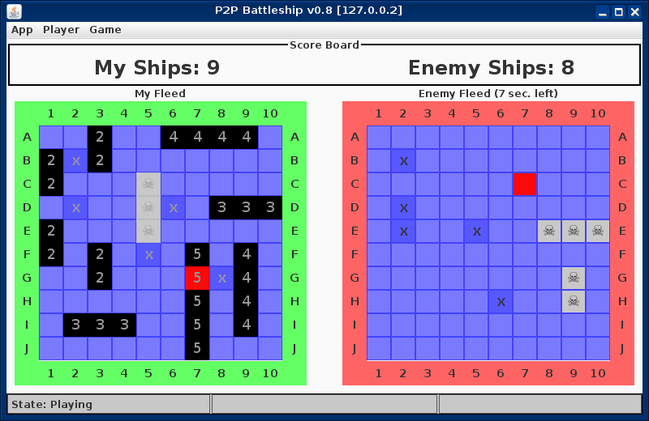

# Battleship
Java II Project: Simple P2P Battleship Game

## Some Notes

* This is free and open software developed for **research and educational** purposes only
* Using UDP on the Transport Layer
* Message <-> Object DeSerialization using Gson
* GUI Framework: Swing
* Development time: ca. 40 hours
* JavaFX version on [fx8 branch](../../tree/fx8)

## Screenshot

